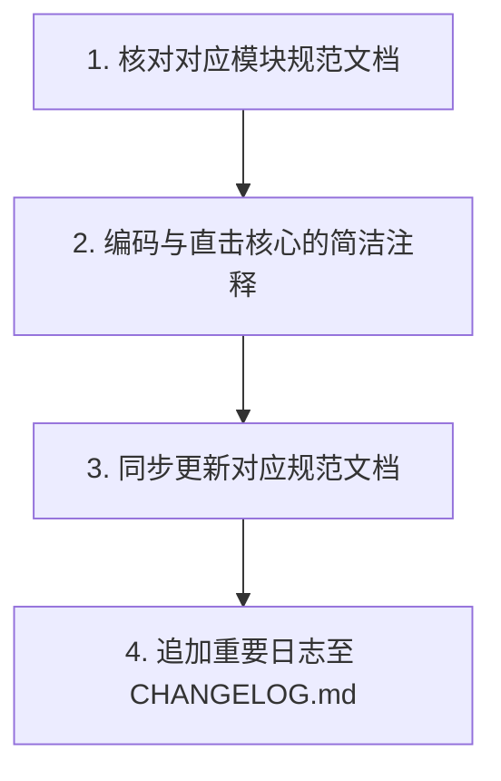

# AGENTS.md - Agent 工作流与红线

## 1. 核心规则
*   **第一性原理**：客观评估，方案缺陷必须直接指出，禁止谄媚迎合。
*   **约束先行**：任何开发或知识管理任务启动前，必须首先在文档（如 `AGENTS.md`、`docs/*` 下的规范文档）中确立或补充对应的规范，然后才能着手修改物理代码，严禁“先实践后改规范”。
*   **工作规约**：文档与沟通默认中文，变量与函数名英文。回复结论先行。
*   **报错红线**：严禁压制/隐藏报错，必须追查根本原因。
*   **安全红线**：严禁硬编码任何密码、密钥或 Token。

## 2. Token 控制与检索准则
*   **索引优先**：任务启动阶段优先查阅 [AGENTS.md](./AGENTS.md) 与 [docs/INDEX.md](./docs/INDEX.md)，禁止盲目全局扫描。
*   **精准读取**：先查阅 `docs/` 下的模块规范文档 -> 用 `grep_search` 定位符号 -> 用 `view_file` (指定 `StartLine`/`EndLine`) 锁定逻辑，禁止无范围加载整文件。
*   **契约约束**：涉及模块间通信或前后端数据交互时，优先查阅 [docs/server/communication.md](./docs/server/communication.md) 及 [docs/frontend/communication.md](./docs/frontend/communication.md)。严禁通过分析具体业务 Handler 的实现细节来逆向推演接口格式或通信载荷，确保架构解耦与信息一致性。

## 3. 核心工作流

1.  **核对规范**：阅读 `docs/` 下对应模块的规范文档（如 `docs/frontend/` 或 `docs/server/` 中的 md 文件）。
2.  **编码注释**：编写高效、直击核心的简洁代码注释。
3.  **同步规范**：若增删改代码影响了设计，同步更新对应的 `docs/` 规范文档。

## 4. 模块地图
*   **前端应用规范**：[docs/frontend/](./docs/frontend/) - 前端状态管理、网络接口及大图引用计数缓存契约。
*   **后端服务规范**：[docs/server/](./docs/server/) - 后端 SQLite DDL、Watchdog 防抖异步扫描及下载状态机。
*   **系统架构及 API 原始指南**：[API_DOCUMENTATION.md](./docs/API_DOCUMENTATION.md) - 2FMusic 核心通信、鉴权与业务数据交互协议总览。

## 5. 仓库结构与更新指南
*   **仓库结构**：
    *   本仓库 `2FMusic` 为主项目。
    *   [folia-major](./folia-major/) 是一个 fork 自上游开源项目 `https://github.com/chthollyphile/folia-major` 的定制化前端展示子模块（独立仓库 `https://github.com/yuexps/folia-major`），作为 Git Submodule 关联在主项目下。
*   **子模块同步上游最新代码指南**：
    1. **进入子模块**：`cd folia-major`
    2. **配置上游源**：`git remote add upstream https://github.com/chthollyphile/folia-major.git` (已配置可忽略)
    3. **拉取更新**：`git fetch upstream`
    4. **合并并解决冲突**：`git merge upstream/main`（需妥善保留/融合 2FMusic 在 `App.tsx`、`SettingsModal.tsx` 等处的 iframe 适配与样式定制）。
    5. **安装依赖与验证构建**：运行 `npm install` 并通过 `npm run build` 确保无警告（修复如 `z-[85]` 等类名为 `z-85`）成功打包。
    6. **推送与指针更新**：通过本地终端执行 `git push origin main`。最后在 `2FMusic` 主项目仓库下提交子项目指针和 `CHANGELOG.md` 更新。
