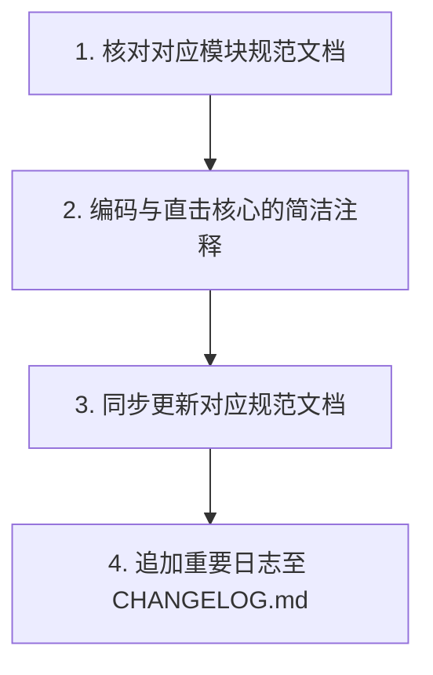

# AGENTS.md - Agent 工作流与红线

## 1. 核心规则
*   **第一性原理**：客观评估，方案缺陷必须直接指出，禁止谄媚迎合。
*   **约束先行**：任何开发或知识管理任务启动前，必须首先在文档（如 `AGENTS.md`、`docs/*` 下的规范文档）中确立或补充对应的规范，然后才能着手修改物理代码，严禁“先实践后改规范”。
*   **工作规约**：文档与沟通默认中文，变量与函数名英文。回复结论先行。
*   **报错红线**：严禁压制/隐藏报错，必须追查根本原因。
*   **安全红线**：严禁硬编码任何密码、密钥或 Token。

## 2. Token 控制与检索准则
*   **索引优先**：任务启动阶段优先查阅 [AGENTS.md](./AGENTS.md) 与 [docs/INDEX.md](./docs/INDEX.md)，禁止盲目全局扫描。
*   **精准读取**：先查阅 `docs/` 下的模块规范文档 -> 用 `grep_search` 定位符号 -> 用 `view_file` (指定 `StartLine`/`EndLine`) 锁定逻辑，禁止无范围加载整文件。
*   **契约约束**：涉及模块间通信或前后端数据交互时，优先查阅 [docs/api.md](./docs/api.md)、[docs/backend.md](./docs/backend.md) 及 [docs/frontend.md](./docs/frontend.md)。严禁通过分析具体业务 Handler 的实现细节来逆向推演接口格式或通信载荷，确保架构解耦与信息一致性。

## 3. 核心工作流

1.  **核对规范**：阅读 `docs/` 下对应模块的规范文档（[docs/api.md](./docs/api.md)、[docs/backend.md](./docs/backend.md) 或 [docs/frontend.md](./docs/frontend.md)）。
2.  **编码注释**：编写高效、直击核心的简洁代码注释。
3.  **同步规范**：若增删改代码影响了设计，同步更新对应的 `docs/` 规范文档。

## 4. 模块地图
*   **通信与 API 规范**：[docs/api.md](./docs/api.md) - REST API 接口、WebSocket 消息帧格式及全量 Action 路由动作。
*   **后端服务规范**：[docs/backend.md](./docs/backend.md) - SQLite 3 DDL 结构、Watchdog 2.0s 防抖监听、增量扫描与下载状态机。
*   **前端应用规范**：[docs/frontend.md](./docs/frontend.md) - 前端 SPA 架构、未登录门禁、Pinia 状态管理及 IndexedDB 缓存。
*   **Android 规范**：[docs/android.md](./docs/android.md) - Android 原生播放点播与 LrcParser 高精度歌词解析算法。

## 5. 仓库结构与更新指南
*   **仓库结构**：
    *   本仓库 `2FMusic` 为主项目，包含 Go 高性能后端服务与前端 SPA 应用。
